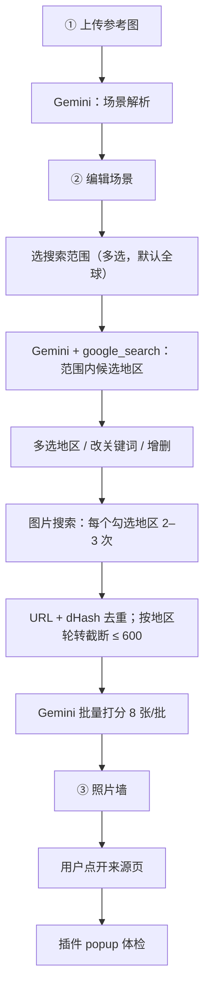

# 窗景找房：技术设计文档 v0.10

- 状态：v0.10 已批准；阶段 0 进行中（待 H0-1）
- 定位：单人业余项目。能用文件不用数据库；能用云端开关不自己写计费；前端单页。
- 平台：macOS · Python 3.11+ · Chrome（运行）；Claude Code 云端会话（开发）
- 外部服务：Gemini API（付费层，含 Google Search grounding）；图片搜索 `ddgs`（默认）/ Brave（M1 实测对比）
- v0.8 变更（用户决策，附录 D）：删除飞行时长；地区偏好系数改为「搜索范围」前置多选；排序只用视觉分；地区可多选
- v0.9 变更（第四轮审计，附录 E/F）：通用关键词默认关；按地区设搜索语言/国家参数；grounding 解析失败兜底；提示词独立文件；新增 Claude 对比与结论
- v0.10 变更（第五轮审计，附录 G）：**[阻断] 显式设置 `media_resolution`**（Gemini 3 默认每图 1,120 token，非 300）；**[阻断] 思考配置改为 `thinking_level`，费用表补输出 token 列并重算**；删除上游需求文档引用（本文第 1 节即目标）；开发环境改为 Claude Code 云端会话并补充其限制；第 7 节按开发阶段重写人工事项

---

## 1. 目标

### 1.1 目标
- 本地网页：上传理想窗景图 → 编辑场景解析 → 选搜索范围 → 找地区并多选 → 照片墙（排序、筛选、点击跳来源页）。
- 候选地区附推荐月份、引用链接。
- 点开页面后点插件按钮 → 🟢/🟡/🔴 + ≤ 3 条证据。
- 单机本地运行；对输入图通用；不自动爬取第三方站点。

### 1.2 非目标
- 房源库、实时价格、日历、预订。
- 飞行时长、可达性。
- DEM / 视域计算。
- 多用户、云端、移动端、Chrome 商店发布。
- 绕过登录、验证码、反爬；自动翻页。
- 标注校准、Inside Airbnb、列表页采集、原图复评（附录 B）。

### 1.3 成功标准
- 用例 #1：照片墙前 50 张对味 ≥ 15 张（对味 = 同时满足权重 ≥ 0.7 的核心要素）。
- 通用性：另 2 张风格不同的参考图各 ≥ 10 张。
- 所选范围内给出 ≥ 5 个候选地区。
- 体检：点开 15 页，明显不符 ≤ 3 页。
- 耗时：从上传到照片墙完整显示 ≤ 10 min。

---

## 2. 需求

### 2.1 功能需求

| ID | 需求 | 里程碑 |
|---|---|---|
| FR-1 | 上传参考图 → 场景解析：摘要、核心要素（含权重）、通用关键词（不带地名） | M1 |
| FR-2 | UI 编辑摘要、核心要素（增删、权重滑块）、关键词；「启用通用关键词」开关默认关（关时只按地区关键词搜图）；保存 | M1 |
| FR-3 | 搜索范围：多选大区（默认「全球」）+ 自由输入（如「云南」「意大利南部」） | M1 |
| FR-4 | 找地区：Gemini + Google Search grounding，限定在所选范围内 → 10–15 个地区（城市、街区、理由、推荐月份、2–3 条本地语言关键词）；展示原始返回、引用链接、Search Suggestions；解析失败时只展示原文与 Suggestions，地区由用户手动添加 | M1 |
| FR-5 | 地区卡片：多选；改关键词；手动增删地区 | M1 |
| FR-6 | 图片搜索：仅对勾选地区，每个 2–3 次；下载缩略图；URL + dHash 去重；按地区轮转截断（默认 600） | M1 |
| FR-7 | 打分：缩略图 8 张/批；分数 = 核心要素带权几何平均 | M1 |
| FR-8 | 照片墙：按分数排序；筛选（最低分、地区多选、来源类型）；卡片含分项、地区、来源标签 `[房源]`/`[种草帖]`/`[其他]`；点击新标签打开；进度轮询 | M1 |
| FR-9 | run 历史：顶栏下拉切换 | M1 |
| FR-10 | 插件 popup「体检」：当前页大图 ≤ 20 张 + 正文 ≤ 8,000 字 → `/api/audit` | M2 |
| FR-11 | 种草帖：体检输出民宿名 → popup 拼携程/途家/Airbnb 搜索链接 | M2 |

### 2.2 非功能需求
- 合规：插件只读用户主动点按钮的页面；服务只监听 127.0.0.1:8765；grounding 按 3.6 使用。
- 隐私：付费层，请求不用于改进 Google 产品。离机数据：图片 → Gemini；搜索词 → Google（grounding）与 DuckDuckGo / Brave。
- 健壮：搜索失败跳过；模型输出不合 schema 重试 1 次，仍失败该批标 `unscored` 排墙底；API 报错原样显示在 UI 并附提示。
- 费用防护：AI Studio 项目 Spend Cap（人工设置）+ `MAX_MODEL_CALLS_PER_RUN = 300`。
- 费用可观测：每次模型调用把 `usage_metadata`（输入、输出、思考 token）写入 `run.log`；run 结束汇总；**单图输入 token 偏离 3.5 设定值 > 30% 时在 UI 显示警告**（防 `media_resolution` 未生效）。
- 启动：`uv sync && uv run dreamview`；无 Docker、Node 构建、PyTorch。

---

## 3. 设计

### 3.1 形态
- 一个 FastAPI 进程：单页 UI + JSON 接口 + 缩略图静态目录。
- UI：`index.html` + `app.js` + 本地 `alpine.min.js`。
- 存储：文件夹，无数据库。删除 run = 删目录。

```
dreamview/
  pyproject.toml  .env.example
  dreamview/  app.py  config.py  gemini.py  search.py  images.py  scoring.py
              schemas.py  store.py  pipeline.py      # 数据结构、run 目录读写、后台任务（M1 实现时拆出）
              static/  index.html  app.js  alpine.min.js  style.css
              prompts/  analyze.md  regions.md  regions_json_fallback.md  score.md  audit.md   # 提示词独立文件，改提示词不改代码
  extension/  manifest.json  popup.html  popup.js  content.js
  runs/<run_id>/  ref.jpg  scene.json  regions.json  results.json  thumbs/  run.log   # .gitignore
  tests/                 # pytest，不联网、不需要 API Key
  eval/  log.md          # 仓库公开：参考图只存本机 eval/，已 .gitignore
  docs/  dreamview_tech_design.md
```

### 3.2 UI（单页三步）

| 区域 | 内容 |
|---|---|
| 顶栏 | run 下拉、「新建」 |
| ① 上传 | 拖拽 → 解析 → 进入 ② |
| ② 场景 + 地区 | 左：摘要、核心要素表、关键词。右上：「启用通用关键词」开关（默认关）；**搜索范围**多选标签（全球 / 中国大陆 / 香港 / 日本 / 台湾 / 地中海 / 东南亚 / …，来自 `config.py`）+ 自由输入框。右下：「找地区」→ 地区卡片（复选框、理由、月份、关键词）+「全选 / 全不选」+ Search Suggestions 块 + 引用列表 + 可折叠「原始返回」；「手动加地区」 |
| ③ 照片墙 | 「搜图并打分」（显示已勾选地区数与预计搜索次数）→ 进度条；网格边跑边长；筛选；标注「图片来自 DuckDuckGo / Brave」，与 ② 的 Google 结果分区展示 |

### 3.3 流程



### 3.4 接口

| 方法 / 路径 | 用途 |
|---|---|
| `GET /api/runs` | run 列表 |
| `POST /api/runs` | 上传 → `run_id` + 场景解析 |
| `PUT /api/runs/{id}/scene` | 保存编辑 |
| `POST /api/runs/{id}/regions` | 传入搜索范围，grounding 找地区 |
| `PUT /api/runs/{id}/regions` | 保存勾选 / 修改 |
| `POST /api/runs/{id}/search` | 后台任务：搜索 + 下载 + 打分 |
| `GET /api/runs/{id}` | 状态、进度、结果 |
| `POST /api/audit` | M2 |

### 3.5 模型

| 配置 | 默认 | 说明 |
|---|---|---|
| `GEMINI_MODEL` | `gemini-3.5-flash-lite` | 0.30 / 2.50 USD 每百万 token（输入 / 输出，思考 token 按输出计）；在 grounding 支持列表内 |
| `GEMINI_MODEL_STRONG` | 空（= 上一项） | 可选：解析、体检单独升级 |
| `MEDIA_RES_ANALYZE` | `high` | 解析参考图，1 张，约 1,120 token |
| `MEDIA_RES_SCORE` | `low` | 打分缩略图，约 280 token/张 |
| `MEDIA_RES_AUDIT` | `medium` | 体检页面大图，约 560 token/张（窗景细节需要比缩略图高） |
| `THINKING_LEVEL` | `minimal`（模型不支持则 `low`） | 解析、打分、体检；找地区用 `low` |

**媒体分辨率（v0.10 阻断项修正）**
- Gemini 3 的图片 token 数由 `media_resolution` 档位决定，与像素尺寸基本无关：low ≈ 280、medium ≈ 560、high ≈ 1,120、ultra_high ≈ 2,240；**未设置时默认 1,120**。
- v0.9 的「每图约 300」只在 low 档成立；不设置则打分输入 token 约 ×3.5、体检约 ×2.5。
- 实现：`gemini.py` 每个函数在 `GenerateContentConfig` 中显式传入对应档位，不依赖默认值；三个档位进 `config.py`，可在 `.env` 覆盖。
- 缩略图上传前仍压到长边 ≤ 512 px（只为减小请求体积，不影响 token）。
- 校验：首跑读 `usage_metadata.prompt_tokens_details` 中 IMAGE 模态 token 数 ÷ 图片数，与上表比对；偏差 > 30% 时 UI 警告（2.2）。

**思考（v0.10 阻断项修正）**
- Gemini 3 用 `thinking_config.thinking_level` 控制思考深度，不再用 `thinking_budget`（token 数）。
- 思考 token 按输出单价计费，记入 `usage_metadata.thoughts_token_count`；4.3 的输出列已含估计值。

**结构化输出**
- 解析、打分、体检用 `response_schema` + Pydantic。
- 找地区：先用 `response_schema` + `google_search`（官方文档：Gemini 3 预览支持）；报错则退回「JSON 代码块 → 去围栏 → Pydantic」；仍失败则只展示原文与 Suggestions，用户手动加地区。

### 3.6 Google Search grounding

**可用性**

| 事实 | 含义 |
|---|---|
| AI Pro 订阅不含 API 配额；API 走 AI Studio Key + Cloud Billing | 订阅不能直接用 |
| Gemini 3.x 免费层不可用；付费层每月 5,000 次搜索免费，之后 14 USD/1k | 必须绑账单；本项目每次约 5–10 次 |
| AI Pro 自 2026-01 起附每月 10 USD Cloud 额度，需在 Developer Program「My benefits」激活 | 以你账号页面为准 |

**条款与处理**

| 条款 | 处理 |
|---|---|
| 须展示 grounded 结果与 Search Suggestions | 渲染 `searchEntryPoint.renderedContent`；卡片 + 可折叠原始返回 |
| 不得修改 grounded 结果或穿插其他内容 | 卡片字段原样展示；图片结果放 ③ 并标注来源 |
| 不得在链接与目标页之间插入中间页 | 引用为直接 `<a>` |
| 禁止缓存、分析、建索引、用链接抓取 | 程序不抓取引用链接、不做点击统计 |
| 「用户查看自己历史」用途可保存，最长 2 年 | `regions.json` 依此保存 |
| 灰色地带：地区名被用作图片搜索关键词 | **已确认处理方式**：只有用户勾选（可多选）的地区才进入图片搜索；关键词可改；程序不自动转发 |

### 3.7 图片搜索

| 选项 | 费用 | 结论 |
|---|---|---|
| `ddgs` | 0，免注册；`images(max_results≤100)` | 默认。非官方，请求间隔 1–2 s |
| Brave Search API | 每月赠 5 USD ≈ 1,000 次；需绑卡；可锁 5 USD | 同签名第二实现，`.env` 切换 |

- 搜索次数 = 勾选地区数 × 2–3（+ 通用关键词数，若开启）。缩小范围、少勾地区即直接减少搜索、下载与打分量。
- 每个地区的查询带该地区的语言/国家参数（`ddgs` 的 `region` 如 `cn-zh`、`jp-jp`、`it-it`；Brave 的 `country` + `search_lang`），提高本地站点结果比例。地区 → 参数的映射由找地区步骤一并返回，缺省 `wt-wt`。
- M1 用用例 #1 对比两者的中国大陆候选数，数据定默认（H9，**必须在本机做**：云端会话出口为数据中心 IP，结果不具代表性）。

### 3.8 关键规则
- 分数：核心要素 0–10，带权几何平均。无其他乘数。
- 地区偏好通过「搜索范围」前置表达，不进排序；多地区结果可在照片墙按地区筛选。
- 地区标签 = 搜出该图的查询所属地区；通用关键词结果标「地区未知」。
- 近重复：dHash，汉明距 ≤ 6 视为同图，保留分辨率高者。
- 截断：按地区轮转取图。
- 来源类型：约 10 个域名规则（airbnb、booking、agoda、ctrip、tujia、xiaohongshu、mafengwo 等）；未命中为 `[其他]`。

### 3.9 插件
- 用户点 popup「体检」才运行；不注入页面。
- `content.js`：`naturalWidth ≥ 300` 的 ``（≤ 20 张）+ `innerText`（≤ 8,000 字）。
- 图片字节：默认本地服务按 URL 拉取，`Referer` 设为页面 URL；M2 首日实测，失败率高时加 service worker 回退。
- 懒加载相册：用户先翻一遍；少于 3 张图时提示「仅基于文本」。
- 体检项：卧室窗景核对、广角与遮挡、硬条件（整租、≥ 28 晚、≤ 10k USD/月）、评论排雷、推荐月份。

### 3.10 评测
- 用例 #1 + 2 张风格不同的参考图；改提示词后重跑，人工数前 50 张对味数，记入 `eval/log.md`。

### 3.11 开发环境（v0.10 新增）
- 开发在 Claude Code 云端会话进行（消耗 Claude 云端会话额度，见附录 E）；运行与验收在本机 macOS。
- 云端会话现状（2026-10-04 实测）：Python 3.11.15、uv 0.8.17、PyPI、Playwright + Chromium 可用；`generativelanguage.googleapis.com` 可达；`duckduckgo.com`、`*.mm.bing.net`、`api.search.brave.com`、各房源站图片 CDN **被网络策略拒绝（403）**。
- 因此云端只做：编码、单元测试、Gemini 真实调用（需环境 secret）、用仓库内样例缩略图跑打分、Playwright 测 UI。图片搜索与下载用录制的 fixture 测试；真实联网搜图在本机验收。
- 容器会回收，`runs/` 不持久，已在 `.gitignore`。

---

## 4. 里程碑与负载

### 4.1 工时

**M1（22–26 h）**
- 骨架、FastAPI、`.env`、run 列表：1.5 h
- 场景解析 + 接口：2 h
- UI ①②（含搜索范围多选、地区多选）：4–5 h
- grounding 找地区 + 解析 + 引用 + Suggestions：2 h
- 图片搜索（两实现）+ 下载 + URL/dHash 去重 + 轮转截断：3 h
- 后台任务 + 轮询：1.5 h
- 打分 + 几何平均 + token 记录与偏差警告：2 h
- UI ③ 照片墙 + 筛选：2.5–3 h
- 提示词调优 + 3 图评测：3–5 h

**M2（8–10 h）**
- popup + content script：3 h
- `/api/audit` + 体检提示词 + 种草帖链接：2–3 h
- 三站试页、调提示词、必要时加 SW 抓图：3–4 h

**合计 30–36 h**，每周 8–10 h 约 4 周。编码部分应在 Claude 云端会话额度过期（2026-11-04）前完成。

### 4.2 资源
- 服务器 0；依赖约 100 MB；每次运行约 15–30 MB 缩略图。

### 4.3 Token 与费用（全球范围、勾 8–10 个地区、600 张、20 页体检；v0.10 重算）

单价：输入 0.30、输出 2.50 USD/百万 token；输出含思考 token。

| 步骤 | 调用 | 每次输入 | 每次输出 | 输入合计 | 输出合计 | USD |
|---|---|---|---|---|---|---|
| 解析（high，1 图） | 1 | ≈ 2k | ≈ 1k | 2k | 1k | < 0.01 |
| 找地区（grounding） | 1 | ≈ 10k | ≈ 3k | 10k | 3k | ≈ 0.01 |
| 打分（low，8 图/批 × 75 批） | 75 | ≈ 2.9k（8 × 280 + 提示词 700） | ≈ 400 | 220k | 30k | ≈ 0.14 |
| 体检（medium，≤ 20 图 + 8,000 字） | 20 | ≈ 18k（20 × 560 + 正文约 6k + 提示词 1k） | ≈ 1k | 360k | 20k | ≈ 0.16 |
| 图片搜索 | 16–30 | — | — | — | — | 0 |
| grounding 搜索 | 5–10 次 | — | — | — | — | 0（月 5,000 次免费内） |
| **合计** | | | | **≈ 59 万** | **≈ 5.4 万** | **≈ 0.31** |

- 若未设置 `media_resolution`（默认 1,120/图）：打分输入约 73 万、体检约 59 万，合计约 0.54 USD/次。2.2 的偏差警告用于发现这种情况。
- 只选一个大区、勾 3–4 个地区时：搜索约 10 次、图片约 250 张，打分约 0.06 USD。
- 月度（≤ 10 次运行）约 3 USD；AI Pro 每月 10 USD 额度可覆盖。
- 输出 token 占比约 40%，首跑以 `usage_metadata` 校正每批输出与思考 token。

---

## 5. 风险

| 风险 | 缓解 |
|---|---|
| 项目未绑账单 → grounding 报错 | UI 原样显示错误 + 提示 |
| 范围选得太窄，漏掉没想到的好地方 | 默认「全球」；范围随时可改并重新找地区 |
| grounding 地区偏热门、偏英文；含臆断 | 提示词要求经典 + 冷门；引用可查；手动加地区 |
| `response_schema` + grounding 在 3.5 Flash-Lite 上不可用 | JSON 文本回退 |
| `media_resolution` 未生效或 SDK 字段变动 → token 约 ×3 | 显式传参；`usage_metadata` 校验 + UI 警告；Spend Cap 兜底 |
| low 档缩略图细节不足导致误判 | 评测时对比 low / medium 各一次（约 +0.07 USD），数据定档 |
| `minimal` 思考档在该模型不可用 | 回退 `low`；首跑记录思考 token |
| AI Pro 额度不可用 | 每次约 0.31 USD，自付可接受 |
| `ddgs` 限流或失效 | 间隔 + 重试 1 次；切 Brave |
| 云端会话无法访问图片搜索站点 | 云端用 fixture；联网搜图只在本机验收（3.11） |
| 中文站覆盖差 | 本地语言关键词；对比两家；接受 |
| 缩略图误判 | 用户肉眼复核；原图复评待办 |
| 推荐月份不准 | 标「约」，只作展示 |
| 体检图片取不到 | 服务端带 Referer；不行加 SW 回退 |
| Spend Cap 生效有延迟 | 本地调用上限兜底 |
| 模型下线或涨价 | 模型名在 `.env` |
| Claude 云端会话额度 11-04 过期，编码未完成 | 编码前置；过期后在本机继续或按需付费 |

---

## 6. 待决项
- 无。

---

## 7. 需要人工完成的事项（按开发阶段；v0.10 重写）

### 阶段 0：开工前（云端，≤ 2026-10-07）
- H0-1：领取 Claude 云端会话额度（截止 10-07，11-04 过期）。途径：打开 claude.ai/code 的领取提示，或公告链接 `claude.ai/code/claim-credit/10`，或本机 Claude Code CLI 执行 `/claim-credit`（云端会话与 Web 端无此命令；本机需较新版本 CLI）。核对：claude.ai 设置 → Usage。
- H0-2：✅ 已批准 v0.10。
- H0-3：✅ 取消。不需要上游需求文档，本文第 1 节即目标。
- H0-4：✅ 沿用 `liu3tao/screen_mirror`；旧文件已删除。
- H0-5：✅ 仓库公开；参考图不入库，`eval/` 只跟踪 `log.md`。

### 阶段 1：账号与密钥（M1 编码开始前，约 40 min）
- H1：developers.google.com/program → My benefits → 激活 AI Pro 每月 Cloud 额度 → 关联账单账户。
- H2：AI Studio → 新建项目与 API Key → 关联 H1 账单账户（付费层）。
- H3：AI Studio → Spend / Usage Limits → 项目月上限 10 USD。
- H4（可选）：Brave Search API 注册 → 绑卡 → 月上限 5 USD。
- H5：云端环境设置 → Environment secrets 加入 `GEMINI_API_KEY`（及可选 `BRAVE_API_KEY`）。
- H6（可选）：云端环境设置 → Network access → Custom，加 `duckduckgo.com`、`*.duckduckgo.com`、`*.mm.bing.net`、`api.search.brave.com`，保留默认包管理器列表。不加则云端只用 fixture。
- H7：确认 `config.py` 硬约束（整租、2 人、≤ 10k USD/月、≥ 28 晚）与搜索范围标签列表。
- H8：准备 3 张参考图（用例 #1 + 2 张风格不同），存本机 `eval/`。云端测试用无版权的合成图或公开授权图作 fixture。

### 阶段 2：M1 编码（云端，Claude 执行）
- H9：评审每个 PR / 提交；回答实现中的问题；合并。
- H10：每次合并后在本机 `git pull` 冒烟（可选，阶段 3 前至少一次）。

### 阶段 3：M1 本机验收（约 1 h）
- H11：`brew install uv`；`git clone`；`cp .env.example .env` 填 key；`uv sync && uv run dreamview`；浏览器打开 `http://127.0.0.1:8765`。
- H12：3 张参考图各走一遍；人工数前 50 张对味数；记入 `eval/log.md`。
- H13：读 `run.log` token 汇总：单图输入 ≈ 280（打分）/ 560（体检）；总费用偏差 > 30% 则回报更新本文。
- H14：用例 #1 分别用 `ddgs`、Brave 跑一次，记中国大陆候选数，定默认。
- H15（可选）：low / medium 打分各跑一次用例 #1，定 `MEDIA_RES_SCORE`。
- H16：把 `eval/log.md` 与结论提交（或贴给 Claude 提交）。

### 阶段 4：M2（本机，约 30 min + 编码评审）
- H17：`chrome://extensions` → 开发者模式 → 加载 `extension/`。
- H18：Chrome 登录要用的平台（国内平台需国内手机号；没有则跳过）。
- H19：点开 15 页试体检，记录误判与「图片取不到」次数；回报结果，决定是否加 service worker 回退。

### 阶段 5：收尾
- H20：2026-11-04 前把剩余编码任务放在云端会话完成；之后的改动在本机进行。
- H21：每月查看一次 AI Studio 账单与 Spend Cap。

### 不需要
- 房源平台开发者账号、域名、服务器、Node.js、Docker、PyTorch、Chrome 商店发布、Anthropic API Key。

---

## 附录 A：历史简化（v0.4 → v0.6）
- 已砍：SigLIP + PyTorch、SQLite、SSE、自建费用上限与账本、图片代理与 LRU、Provider 抽象、`travel_table`、插件注入浮窗与站点适配、自动体检、M3、Serper。
- 保留：几何平均、结构化输出、重试 1 次后标记、不自动翻页。

## 附录 B：待办（不排期）
- Top-100 原图复评；👍/👎 校准；Inside Airbnb；列表页卡片收集；插件解析 JSON 状态块；导出自包含 `wall.html`；意/西语关键词。

## 附录 C：第三轮审计（对照版 v0.7）
- 接受：dHash、按地区轮转截断、Spend Cap + 调用上限、3 图评测、run 历史、原始返回展示与分区、可选强模型、`ddgs` 默认 + M1 对比、本地 Alpine、`unscored` 排墙底。
- 修正：grounding 可与 `response_schema` 同用（官方文档，预览）；Search grounding 保存期限为 2 年而非 6 个月。
- 拒绝：自检接口（UI 显示错误即可）；体检取图默认走 service worker（`fetch` 不能设 Referer）。
- 「乘数 + 筛选器」之争已由 v0.8 用户决策取代。

## 附录 D：v0.8 用户决策

| 决策 | 影响 |
|---|---|
| 飞行时长不重要，删除 | 删除：grounding 输出字段、卡片输入框、可达性系数、照片墙筛选、体检卡中的耗时、出发地配置 |
| 地区偏好改为前置限定搜索范围（可多选） | 删除地区偏好系数与排序切换；新增 FR-3；grounding 提示词带范围；数据量随范围缩小 |
| 接受「勾选后才用地区名搜图」，地区可多选 | 3.6 灰色地带处理定稿；卡片复选框 + 全选 / 全不选 |

- 排序只剩视觉分，照片墙只有一种排序。
- 风险：范围过窄会漏掉冷门地区，靠默认「全球」缓解。

## 附录 E：模型提供商（Gemini vs Claude，2026-10-04 核实）

**结论：运行时用 Gemini；Claude Pro 云端会话额度只用于开发阶段（Claude Code 写代码）。不做双提供商支持。**

| 项 | Gemini | Claude |
|---|---|---|
| 订阅能否代替 API | AI Pro 不含 API 配额，但附每月 10 USD Cloud 额度 | Pro 不含 API 额度；订阅登录凭证仅限 claude.ai 与 Claude Code，用于自写程序违反消费者条款 |
| 促销额度 | — | Pro 一次性 100 USD，仅限 Claude Code 云端会话；10-07 前领取、需绑 GitHub、11-04 过期；不能付 API 费用 |
| 单价（每百万 token） | `3.5-flash-lite` 0.30 / 2.50 | Haiku 4.5 1 / 5；Sonnet 5.5 2 / 10 |
| 图片 token | 按档位固定：low 280 / medium 560 / high 1,120 | 约 宽 × 高 / 750；474 × 316 缩略图约 200 |
| 打分（600 张） | 约 0.14 USD（low） | Haiku 约 0.35；Sonnet 5.5 约 0.70 USD |
| 搜索 | 每月 5,000 次免费 | 10 USD / 1k 次，无免费额度 |
| 单次运行（600 张 + 20 页体检） | 约 0.31 USD | Haiku 约 0.75–1.1 USD |
| 月度（10 次） | 约 3 USD；有 AI Pro 额度净 0 | 约 7–11 USD，自付；首次最低预付 5 USD |
| 账单 | Cloud 项目 + Spend Cap | Console 预付，充多少花多少 |
| 结构化输出 + 搜索同用 | 支持（预览） | 支持 |

- Claude Message Batches 半价，但为异步，与「边跑边长、≤ 10 min」冲突，不采用。
- 打分质量两家均未实测。可选：在云端会话中让 Claude 对评测缩略图人工式打分一次，与 Gemini 分数对比（消耗会话额度，不需 API Key）；仅作参考，不进入产品。
- 若日后要换：模型调用集中在 `gemini.py` 的 4 个函数，换成 `claude.py` 约 2–4 h；只换打分约 1–2 h；3.6 条款节需按 Anthropic 条款重写。

## 附录 F：第四轮审计（对照版 v0.7 修订）

| 对照版内容 | 处理 | 理由 |
|---|---|---|
| 「启用通用关键词」开关，默认关 | 合并 | 与用户「先限定范围、减少数据量」一致；关掉后每张图都有确定地区 |
| Brave `country` / `search_lang` 参数 | 合并并扩展到 `ddgs` 的 `region` | 按地区本地化搜索，是成本最低的中文/日文覆盖改进 |
| grounding 解析失败 → 只显示原文 + 手动加地区 | 合并 | 明确最后一级兜底 |
| `prompts/*.md` 独立文件 | 合并 | 调提示词不改代码 |
| 来源标签 `[其他]`、域名示例 | 合并 | 无成本 |
| 隐私中列出搜索词去向 | 合并 | 原文漏写 |
| 成功标准「≤ 10 min」 | 合并 | 给后台任务一个可检验目标 |
| 风险「模型下线或涨价」 | 合并 | 原文漏写 |
| 附录 F：Claude 对比 | 合并为附录 E | 补充预付费天然封顶、新账号限速等非费用因素；费用取两份估算区间 |
| 决策 4「Gemini 还是 Claude，二选一」 | 已关闭 | 结论见附录 E |
| 飞行时长、地区偏好乘数、排序切换 | 不合并 | 已被 v0.8 用户决策取代；对照版尚未更新 |
| 自检接口、SW 默认抓图、`response_schema` 与 grounding 不兼容、6 个月保存期 | 不合并 | 理由见附录 C，对照版未给新证据 |
| Claude 结构化输出「已 GA」、Gemini「不能同调」 | 修正 | Gemini 3 同样支持（预览），两家在这点上无差异 |

## 附录 G：第五轮审计（v0.9 → v0.10）

| 问题 | 级别 | 处理 |
|---|---|---|
| 每图 300 token 的假设只在 `media_resolution=low` 成立；Gemini 3 默认 1,120 | 阻断 | 3.5 按步骤显式设档；2.2 加 token 校验与警告；4.3 重算；风险表新增 |
| 「思考预算最低档」不适用 Gemini 3；费用表无输出 token | 阻断 | 改用 `thinking_level`；4.3 拆输入 / 输出列，总价 0.25 → 0.31 USD |
| 上游需求链接为本机 `file://` 路径 | 一般 | 删除引用；本文第 1 节即目标 |
| 云端会话无法访问图片搜索站点；数据中心 IP 不适合做 ddgs/Brave 对比 | 一般 | 新增 3.11；H6 可选放行；H14 必须本机 |
| 附录 E「据报道底层为 Brave 索引」未经核实 | 一般 | 删除 |
| Claude 云端额度条款「据多方来源」 | 一般 | 已核实，改为确定表述 |
